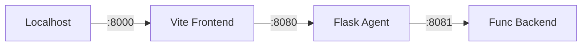

# Orchestration Minimum Spec (2026-01-13)

> **Purpose**: Defined constraints for the 3-repository workspace.
> **Scope**: `flow` (Reasoning), `estimate-backend-calc` (Calculation), `estimation-ui-app` (Presentation).

## 1. Runtime Wiring

### Connection Topology


### Deployment & Ports
| Component | Local Port | Azure Resource | Critical Env Vars (Value Masked) |
| :--- | :--- | :--- | :--- |
| **UI** | `8000` | Azure Static Web Apps | `VITE_API_ENDPOINT` (Url to Agent) |
| **Agent** | `8080` | Azure Container Apps | `CALC_API_URL` (Url to Calc)<br>`CALC_API_KEY` (Func Key)<br>`AZURE_OPENAI_API_KEY`<br>`AZURE_OPENAI_ENDPOINT` |
| **Calc** | `8081`* | Azure Functions | None (Config via `estimate_config.yaml`) |

*\*Note: 8081 is the User-defined local port. Default Azure Func port is 7071.*

---

## 2. Contract Spec (Agent ↔ Calc API)

### Request Sample (Phase 3 Vendor Mixed)
`POST /calculate_estimate`
```json
{
  "method": "screen",
  "screen_count": 20,
  "complexity": "medium",
  "features": ["auth", "payment", "push_notification"],
  "phase2_items": ["wireframe", "figma"],
  "phase3_items": ["ui_design", "design_system"],
  "confidence": "low"
}
```

### Response Sample (Success)
```json
{
  "status": "ok",
  "estimated_amount": 15000000,
  "estimated_range": {
    "min": 13000000,
    "max": 18000000
  },
  "currency": "JPY",
  "breakdown": {
    "development": { "cost": 10000000, "base_days": 200 },
    "phase2_design": { "cost": 2000000 },
    "phase3_visual": {
      "cost": 3000000,
      "range": { "min": 1000000, "max": 6000000 }
    }
  }
}
```

### Error Sample (Missing Params)
```json
{
  "status": "error",
  "message": "Missing required param: confidence (Required for Phase 3 / Vendor Design estimation)"
}
```

### Required Fields Policy
| Method | Mandatory Fields |
| :--- | :--- |
| `screen` | `method`, `screen_count`, `complexity` |
| `step` | `method`, `loc`, `man_days_per_unit`, `complexity` |
| `fp` | `method`, `fp_count`, `man_days_per_unit`, `complexity` |
| *(Any Phase 3)* | `confidence` (Must be explicit) |

---

## 3. State Machine (Hybrid Input)

### Definitions
- **DRAFT**: `user_input.message`. Free text intent. (e.g., "I want a scalable app")
- **FACT**: `user_input.selected_option`. Explicit button click. (e.g., "High Scalability")

### Trigger
Calculation runs **ONLY** when `selected_option` equals:
- `CALCULATE_ESTIMATE`
- `見積もり作成`
- `計算する`

### Payload Structure
The Agent internal memory (`collected_params`) is built exclusively from **FACTs**.
```python
# Session State Structure
self.collected_params = {
    "method": "screen",        # Options: screen, step, fp
    "features": [],            # List of stable keys (e.g., auth, payment)
    "screen_count": 10,        # Integer
    "complexity": "medium",    # low, medium, high
    "phase2_items": [],        # wireframe, figma...
    "phase3_items": [],        # ui_design...
    "confidence": "low"        # Critical for Phase 3
}
```

---

## 4. Do-Not-Break List

### Stable Keys (Modifying these breaks regression)
- **Feature Keys**: `auth`, `payment`, `external_api`, `admin_panel` ...
- **Method Keys**: `screen`, `step`, `fp`
- **Complexity**: `low`, `medium`, `high`
- **Output Keys**: `estimated_amount`, `estimated_range`, `breakdown`

### Safety Switches (Configuration)
- **Location**: `estimate-backend-calc/estimate_config.yaml` at root.
    - `require_explicit_productivity_for_step_fp`: **True** (Prevents implicit multiplication)
    - `require_explicit_vendor_confidence`: **True** (Prevents implicit variance)

### Golden Regression Cases
1.  **Simple App**: `method=screen`, `screens=10`, `features=[auth]`. Should yield Fixed Price.
2.  **Migration**: `method=step`, `loc=10000`, `productivity=0.05`. Should yield Fixed Price based on LOC.
3.  **Vendor Mixed**: `method=screen`, `phase3=[ui_design]`, `confidence=low`. Should yield **Range** Result.
