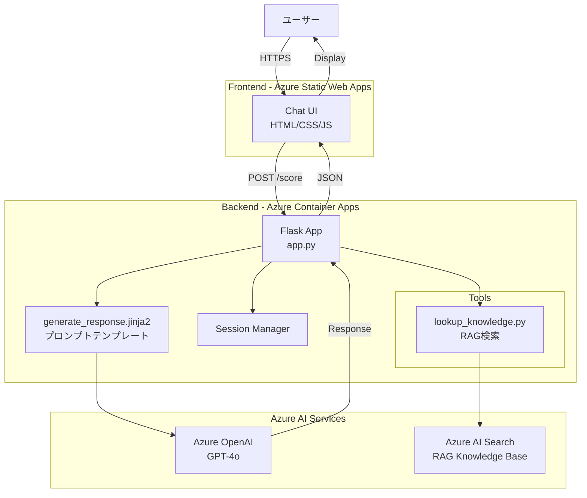
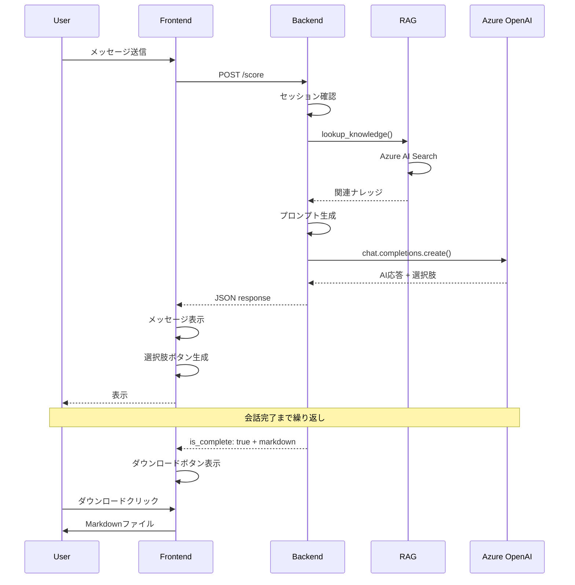
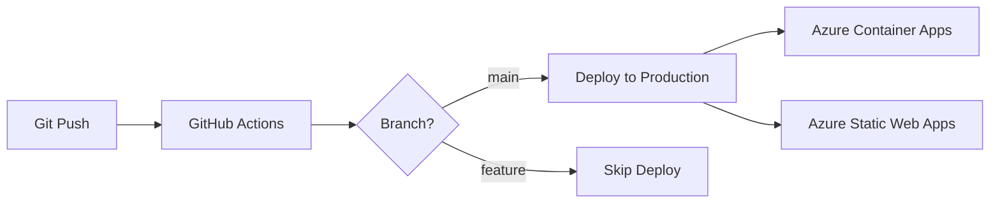

# 基本設計書 - AI見積もりシステム V2

**プロジェクト名**: AI見積もりシステム V2  
**バージョン**: 2.0  
**作成日**: 2025-12-30

## 1. システム構成

### 1.1 全体アーキテクチャ



### 1.2 データフロー図



## 2. フロントエンド設計

### 2.1 画面構成

```
┌─────────────────────────────────────────────────────────┐
│  Header                                                  │
│  ┌─────────────────────────────────────────────────┐   │
│  │  AI見積もりシステム          [最初からやり直す]  │   │
│  │  開発コストとデザインフェーズをサポート          │   │
│  └─────────────────────────────────────────────────┘   │
├─────────────────────────────────────────────────────────┤
│  Chat Timeline (スクロール可能)                         │
│  ┌─────────────────────────────────────────────────┐   │
│  │                                                  │   │
│  │  [AI] ┌──────────────────────────────┐          │   │
│  │       │ AI: どのようなシステムを      │          │   │
│  │       │     開発されますか？          │          │   │
│  │       └──────────────────────────────┘          │   │
│  │  ┌────────┐ ┌────────┐ ┌────────┐ ┌────────┐  │   │
│  │  │Web     │ │Mobile  │ │両方    │ │その他  │  │   │
│  │  │アプリ  │ │アプリ  │ │        │ │        │  │   │
│  │  └────────┘ └────────┘ └────────┘ └────────┘  │   │
│  │                                                  │   │
│  │              ┌──────────────────────────────┐ [U]│   │
│  │              │ User: Webアプリケーション    │    │   │
│  │              └──────────────────────────────┘    │   │
│  │                                                  │   │
│  │  [AI] ┌──────────────────────────────┐          │   │
│  │       │ AI: 画面数はどのくらいを      │          │   │
│  │       │     想定していますか？        │          │   │
│  │       └──────────────────────────────┘          │   │
│  │  ┌────────┐ ┌────────┐ ┌────────┐ ┌────────┐  │   │
│  │  │5-10    │ │10-20   │ │20+     │ │その他  │  │   │
│  │  │画面    │ │画面    │ │画面    │ │        │  │   │
│  │  └────────┘ └────────┘ └────────┘ └────────┘  │   │
│  │                                                  │   │
│  └─────────────────────────────────────────────────┘   │
├─────────────────────────────────────────────────────────┤
│  Input Area                                              │
│  ┌─────────────────────────────────────────────────┐   │
│  │  [テキスト入力フィールド]              [送信]   │   │
│  └─────────────────────────────────────────────────┘   │
│  または                                                  │
│  ┌─────────────────────────────────────────────────┐   │
│  │  [ダウンロード] 見積もり書をダウンロード         │   │
│  └─────────────────────────────────────────────────┘   │
└─────────────────────────────────────────────────────────┘
```

### 2.2 コンポーネント設計

#### 2.2.1 Message Component
```html
<!-- AI Message -->
<div class="message ai-message">
  <div class="message-icon">...SVG...</div>
  <div class="message-body">
    <div class="message-content">
      <p>どのようなシステムを開発されますか？</p>
    </div>
    <div class="message-options">
      <button class="option-btn">Webアプリケーション</button>
      <button class="option-btn">モバイルアプリ</button>
      <button class="option-btn">両方</button>
      <button class="option-btn">その他</button>
    </div>
    <div class="message-timestamp">14:20</div>
  </div>
</div>

<!-- User Message -->
<div class="message user-message">
  <div class="message-icon">...SVG...</div>
  <div class="message-body">
    <div class="message-content">
      <p>Webアプリケーション</p>
    </div>
    <div class="message-timestamp">14:20</div>
  </div>
</div>
```

#### 2.2.2 Input Component
```html
<!-- 通常入力 -->
<div class="input-area">
  <input type="text" id="user-input" placeholder="メッセージを入力..." />
  <button id="send-btn" class="btn btn-primary">送信</button>
</div>

<!-- ダウンロードボタン（会話完了時） -->
<div class="download-area" style="display: none;">
  <button id="download-btn" class="btn btn-success">
    📥 見積もり書をダウンロード
  </button>
</div>
```

### 2.3 CSS設計（主要クラス）

```css
/* メッセージコンテナ */
.chat-timeline {
  height: calc(100vh - 300px);
  overflow-y: auto;
  padding: var(--space-4);
}

/* メッセージ */
.message {
  margin-bottom: var(--space-3);
  display: flex;
  gap: var(--space-2);
  max-width: 85%;
  align-items: flex-start;
}

.ai-message {
  flex-direction: row;
}

.user-message {
  flex-direction: row-reverse;
  align-self: flex-end;
}

.message-icon {
  width: 40px;
  height: 40px;
  border-radius: 50%;
  flex-shrink: 0;
}

.message-content {
  background: var(--surface);
  padding: var(--space-3);
  border-radius: var(--radius-lg);
}

.ai-message .message-content {
  background: var(--primary-light);
  border: 1px solid var(--primary);
}

.user-message .message-content {
  background: var(--primary);
  color: white;
}

/* 選択肢ボタン */
.message-options {
  display: flex;
  gap: var(--space-2);
  flex-wrap: wrap;
  margin-top: var(--space-2);
}

.option-btn {
  padding: var(--space-2) var(--space-3);
  background: white;
  border: 2px solid var(--primary);
  border-radius: var(--radius-md);
  color: var(--primary);
  cursor: pointer;
  transition: all var(--transition-base);
}

.option-btn:hover {
  background: var(--primary);
  color: white;
  transform: translateY(-2px);
}

.option-btn:disabled {
  opacity: 0.5;
  cursor: not-allowed;
}
```

### 2.4 JavaScript設計

#### 2.4.1 主要関数
```javascript
// 会話状態管理
const conversationState = {
  sessionId: null,
  history: [],
  isComplete: false,
  markdown: null
};

// メッセージ送信
async function sendMessage(message, selectedOption = null) {
  // 1. ユーザーメッセージを表示
  addUserMessage(message);
  
  // 2. ローディング表示
  showLoading();
  
  // 3. APIリクエスト
  const response = await fetch(API_ENDPOINT, {
    method: 'POST',
    headers: { 'Content-Type': 'application/json' },
    body: JSON.stringify({
      user_input: { message, selected_option: selectedOption },
      conversation_history: conversationState.history,
      session_id: conversationState.sessionId
    })
  });
  
  // 4. レスポンス処理
  const data = await response.json();
  hideLoading();
  
  // 5. AIメッセージを表示
  addAIMessage(data.message, data.options);
  
  // 6. 会話履歴を更新
  conversationState.history.push(
    { role: 'user', content: message },
    { role: 'assistant', content: data.message }
  );
  
  // 7. 完了チェック
  if (data.is_complete) {
    conversationState.isComplete = true;
    conversationState.markdown = data.markdown;
    showDownloadButton();
  }
}

// AIメッセージ追加
function addAIMessage(message, options = []) {
  const messageEl = createMessageElement('ai', message);
  
  if (options && options.length > 0) {
    const optionsEl = createOptionsElement(options);
    messageEl.appendChild(optionsEl);
  }
  
  chatTimeline.appendChild(messageEl);
  scrollToBottom();
}

// 会話リセット
async function handleReset() {
  if (!confirm('最初からやり直しますか？')) return;
  if (conversationState.sessionId) {
    await fetch(`${API_ENDPOINT}/sessions/${conversationState.sessionId}`, { method: 'DELETE' });
  }
  // resetUIandState(); // Assuming this function exists elsewhere to clear UI and reset state variables
  // initializeChat(); // Assuming this function exists elsewhere to re-initialize chat
  location.reload(); // For simplicity, reload the page to reset everything
}

// 選択肢ボタン作成
function createOptionsElement(options) {
  const container = document.createElement('div');
  container.className = 'message-options';
  
  options.forEach(option => {
    const btn = document.createElement('button');
    btn.className = 'option-btn';
    btn.textContent = option.label;
    btn.dataset.value = option.value;
    btn.onclick = () => handleOptionClick(option);
    container.appendChild(btn);
  });
  
  return container;
}

// Markdownダウンロード
function downloadMarkdown() {
  const blob = new Blob([conversationState.markdown], { type: 'text/markdown' });
  const url = URL.createObjectURL(blob);
  const a = document.createElement('a');
  a.href = url;
  a.download = `見積もり相談_${new Date().toISOString().split('T')[0]}.md`;
  a.click();
  URL.revokeObjectURL(url);
}
```

## 3. バックエンド設計

### 3.1 API設計

#### 3.1.1 エンドポイント: POST /score

**リクエスト:**
```json
{
  "user_input": {
    "message": "Webアプリケーションの開発",
    "selected_option": "web_app"
  },
  "conversation_history": [
    {
      "role": "user",
      "content": "見積もりをお願いします"
    },
    {
      "role": "assistant",
      "content": "どのようなシステムですか？"
    }
  ],
  "session_id": "uuid-xxx"
}
```

**レスポンス（会話中）:**
```json
{
  "message": "画面数はどのくらいを想定していますか？",
  "options": [
    { "label": "5-10画面", "value": "5-10" },
    { "label": "10-20画面", "value": "10-20" },
    { "label": "20画面以上", "value": "20+" },
    { "label": "その他", "value": "other" }
  ],
  "is_complete": false,
  "session_id": "uuid-xxx"
}
```

**レスポンス（会話完了）:**
```json
{
  "message": "見積もりが完成しました。",
  "markdown": "# プロジェクト見積もり・提案書\n\n## 1. プロジェクト概要\n...",
  "is_complete": true,
  "session_id": "uuid-xxx"
}
```

### 3.2 セッション管理

```python
# セッション管理（メモリベース - 簡易実装）
sessions = {}

class ConversationSession:
    def __init__(self, session_id):
        self.session_id = session_id
        self.history = []
        self.collected_info = {}
        self.created_at = datetime.now()
    
    def add_message(self, role, content):
        self.history.append({"role": role, "content": content})
    
    def update_info(self, key, value):
        self.collected_info[key] = value
    
    def is_expired(self):
        return (datetime.now() - self.created_at).seconds > 3600  # 1時間
```

### 3.3 会話フロー管理

```python
def determine_next_question(session):
    """
    収集済み情報から次の質問を決定
    """
    info = session.collected_info
    
    # 必須情報のチェックリスト
    required_info = {
        'project_type': 'プロジェクトタイプ',
        'screen_count': '画面数',
        'team_size': 'チームサイズ',
        'duration': '開発期間',
        'design_phase': 'デザインフェーズ状況'
    }
    
    # 未収集の情報を確認
    for key, label in required_info.items():
        if key not in info:
            return generate_question_for(key)
    
    # オプション情報の確認
    optional_info = {
        'ai_features': 'AI機能',
        'api_integration': 'API統合',
        'multilingual': '多言語対応',
        'data_migration': 'データ移行'
    }
    
    for key, label in optional_info.items():
        if key not in info:
            return generate_optional_question_for(key)
    
    # すべて収集完了
    return None  # 見積もり生成へ
```

### 3.4 RAG検索ロジック

```python
def lookup_knowledge(user_input, collected_info):
    """
    ユーザー入力と収集済み情報からRAGを検索
    """
    # 検索クエリの構築
    query_parts = []
    
    if 'project_type' in collected_info:
        query_parts.append(collected_info['project_type'])
    
    if 'design_phase' in collected_info:
        query_parts.append('デザイン')
    
    query_parts.append(user_input.get('message', ''))
    
    query = ' '.join(query_parts)
    
    # Azure AI Search
    results = search_client.search(
        search_text=query,
        top=5,
        select=['content', 'title', 'category']
    )
    
    # 結果を整形
    knowledge = []
    for result in results:
        knowledge.append({
            'title': result['title'],
            'content': result['content'],
            'category': result['category']
        })
    
    return knowledge
```

### 3.5 見積もり生成ロジック

```python
def generate_estimate(session, rag_knowledge):
    """
    RAGの情報を基に見積もりを生成
    """
    info = session.collected_info
    
    # プロンプト構築
    prompt = f"""
    以下の情報を基に、詳細な見積もり・提案書をMarkdown形式で生成してください。
    
    【収集した情報】
    {json.dumps(info, ensure_ascii=False, indent=2)}
    
    【RAGから取得した価格情報】
    {format_rag_knowledge(rag_knowledge)}
    
    【アウトプット形式】
    # プロジェクト見積もり・提案書
    
    ## 1. プロジェクト概要
    ## 2. 要件サマリー
    ## 3. 見積もり詳細
    ### 3.1 開発費用
    ### 3.2 保守・運用費用
    ## 4. 開発スケジュール
    ## 5. 技術スタック
    ## 6. 推奨事項
    ## 7. 前提条件・除外事項
    ## 8. 次のステップ
    
    必ずRAGの価格情報を参照して、具体的な金額を算出してください。
    """
    
    # Azure OpenAI呼び出し
    response = openai_client.chat.completions.create(
        model="gpt-4o",
        messages=[
            {"role": "system", "content": "あなたは見積もり作成の専門家です。"},
            {"role": "user", "content": prompt}
        ],
        temperature=0.7,
        max_tokens=3000
    )
    
    return response.choices[0].message.content
```

## 4. データモデル

### 4.1 会話セッション
```python
{
  "session_id": "uuid-xxx",
  "created_at": "2025-12-30T14:00:00Z",
  "history": [
    {
      "role": "user",
      "content": "見積もりをお願いします",
      "timestamp": "2025-12-30T14:00:01Z"
    },
    {
      "role": "assistant",
      "content": "どのようなシステムですか？",
      "options": ["Webアプリ", "モバイルアプリ", "両方", "その他"],
      "timestamp": "2025-12-30T14:00:02Z"
    }
  ],
  "collected_info": {
    "project_type": "web_app",
    "screen_count": "10-20",
    "team_size": 3,
    "duration": 6
  },
  "is_complete": false
}
```

### 4.2 RAGナレッジ構造
```json
{
  "id": "01",
  "title": "料金表: Webアプリケーション開発",
  "category": "pricing",
  "content": "## 1. 基本開発費用\n- シンプルなWebアプリ: 3,000,000 JPY〜\n...",
  "metadata": {
    "project_type": "web_app",
    "phase": "development"
  }
}
```

## 5. エラーハンドリング

### 5.1 フロントエンド
```javascript
try {
  const response = await fetch(API_ENDPOINT, {...});
  if (!response.ok) {
    throw new Error(`HTTP ${response.status}`);
  }
  const data = await response.json();
} catch (error) {
  showErrorMessage('通信エラーが発生しました。もう一度お試しください。');
  console.error(error);
}
```

### 5.2 バックエンド
```python
@app.route('/score', methods=['POST'])
def score():
    try:
        data = request.get_json()
        # 処理
        return jsonify(response), 200
    except ValueError as e:
        return jsonify({"error": "Invalid input", "message": str(e)}), 400
    except Exception as e:
        logger.error(f"Error: {e}")
        return jsonify({"error": "Internal server error"}), 500

@app.route('/sessions/<session_id>', methods=['DELETE'])
def delete_session(session_id):
    """セッションの削除（やり直し用）"""
    if session_id in sessions:
        del sessions[session_id]
        return jsonify({"message": "Session deleted"}), 200
    return jsonify({"error": "Session not found"}), 404
```

## 6. セキュリティ設計

### 6.1 入力検証
```python
def validate_user_input(user_input):
    """ユーザー入力の検証"""
    if not isinstance(user_input, dict):
        raise ValueError("Invalid input format")
    
    message = user_input.get('message', '')
    if len(message) > 1000:
        raise ValueError("Message too long")
    
    # XSS対策（HTMLエスケープ）
    message = html.escape(message)
    
    return message
```

### 6.2 CORS設定
```python
CORS(app, resources={
    r"/score": {
        "origins": [
            "https://[frontend-url]",
            "http://localhost:8000"  # 開発環境
        ]
    }
})
```

## 7. パフォーマンス設計

### 7.1 キャッシング
```python
# セッション内RAG結果のキャッシュ
session_cache = {}

def get_cached_rag(session_id, query):
    cache_key = f"{session_id}:{query}"
    if cache_key in session_cache:
        return session_cache[cache_key]
    
    result = lookup_knowledge(query)
    session_cache[cache_key] = result
    return result
```

### 7.2 非同期処理
```javascript
// フロントエンド: 非同期でメッセージ送信
async function sendMessage(message) {
  // UI即座に更新
  addUserMessage(message);
  showLoading();
  
  // バックグラウンドでAPI呼び出し
  const response = await fetch(...);
  
  // 完了後にUI更新
  hideLoading();
  addAIMessage(response.message);
}
```

## 8. テスト設計

### 8.1 フロントエンドテスト
- **手動テスト**: ブラウザでの動作確認
- **テストシナリオ**:
  1. 初回メッセージ送信
  2. 選択肢ボタンクリック
  3. 自由記述入力
  4. 会話完了までのフロー
  5. Markdownダウンロード

### 8.2 バックエンドテスト
```python
def test_conversation_flow():
    """会話フローのテスト"""
    # セッション作成
    session_id = str(uuid.uuid4())
    
    # 1回目の質問
    response1 = client.post('/score', json={
        'user_input': {'message': '見積もりをお願いします'},
        'session_id': session_id
    })
    assert response1.status_code == 200
    assert 'options' in response1.json
    
    # 2回目の質問
    response2 = client.post('/score', json={
        'user_input': {'selected_option': 'web_app'},
        'session_id': session_id
    })
    assert response2.status_code == 200
```

## 9. デプロイ設計

### 9.1 デプロイフロー


### 9.2 環境変数管理
```bash
# Production
AZURE_OPENAI_API_KEY=***
AZURE_OPENAI_ENDPOINT=https://***
AZURE_SEARCH_ENDPOINT=https://***
AZURE_SEARCH_KEY=***
FLASK_ENV=production

# Development
FLASK_ENV=development
USE_MOCK_CALC=true
```

## 10. 運用設計

### 10.1 モニタリング
- **Application Insights**: エラー率、レスポンス時間
- **ログ**: 会話履歴、RAG検索クエリ
- **アラート**: エラー率が5%を超えた場合

### 10.2 メンテナンス
- **セッションクリーンアップ**: 1時間以上古いセッションを削除
- **RAG更新**: 新しいナレッジファイルの追加
- **プロンプト改善**: ユーザーフィードバックに基づく調整
